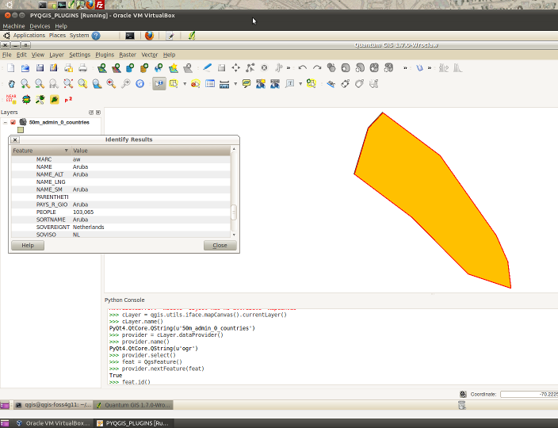

===================================================
Tutorial #2 -- Utilizzare la Console Python di QGIS
===================================================

Impostazioni
------------

\  **1.** \Per iniziare, aprite una nuova sessione di QGIS. I dati che utilizzeremo si trovano nella cartella\  ``natural_earth_50m`` \che trovate in::

    /home/qgis/natural_earth_50m

\  **2.** \Caricate in QGIS i seguenti file::

    /home/qgis/natural_earth_50m/raster/shaded_relief/SR_50M/SR_50M.tif
    
    # rendete non visibile il layer tif in modo da non rallentare il tutto

    /home/qgis/natural_earth_50m/cultural/50m_cultural/50m_populated_places_simple.shp

\  **3.** \Aprite la console Python::

    Plugins > Console python

.. image:: ../_static/python_console.png
    :scale: 100%
    :align: center

-----------------

Accedere ai layer
-----------------

.. note:: Tutti i link che seguono sono relativi alla documentazione delle\  `API QGIS <http://www.qgis.org/api>`_ \. Cliccate su di essi per ottenere informazioni sulle classi e sui metodi cui faremo man mano riferimento.

Ci sono vari modi per accedere ai layer di QGIS. Per ognuno di essi, comunque, si fa riferimento alla classe\  `QgisInterface <http://www.qgis.org/api/classQgisInterface.html>`_\, chiamata\  ``iface`` \nel binding Python. Dalla console Python otteniamo l'accesso a\  ``iface`` \lanciando il seguente comando::
    
    >>> qgis.utils.iface

Lanciate il comando; dovreste ricevere come output::

    >>> qgis.utils.iface
    <qgis.gui.QgisInterface object at 0x925266c>

Otteniamo il nome della classe QGIS con cui stiamo lavorando -- in effetti ``iface`` è l'oggetto ``QgisInterface``. 

Metodo 1
********

La funzione\  `activeLayer() <http://www.qgis.org/api/classQgisInterface.html#231f32fbf95004aebb067cb98f3a391c>`_ \restituisce un riferimento al layer selezionato in legenda.

\  **1.** \Lanciate il seguente comando::

    >>> aLayer = qgis.utils.iface.activeLayer()
    >>> aLayer
    <qgis.core.QgsRasterLayer object at 0x99ea6ec>

L'output del comando dipende dal tipo di layer selezionato, vettoriale e raster, in legenda. L'output dell'esempio si riferisce ad un layer raster.

\  **2.** \Qual'è il nome del layer attivo?

    >>> aLayer.name()
    PyQt4.QtCore.QString(u'SR_50M')

\  **3.** \Come fate a capire quali funzioni fornisce un oggetto Python? Ci sono due modi:

    \1) La maniera più agevole consiste nel navigare tra gli attributi di una classe tramite la documentazione delle\  `API QGIS  <http://www.qgis.org/api>`_ \

    \2) La modalità *pythonic* consiste nel lanciare il comando di *help* sull'oggetto di interesse::
        
            >>> help(aLayer) 

             # output truncated for demonstration
             ...
             |  extent = <built-in function extent>
             |  
             |  getLayerID = <built-in function getLayerID>
             |  
             |  getTransparency = <built-in function getTransparency>
             ...
             # output truncated for demonstration

Il comando *help* generalmente restituisce un testo lungo e difficile da navigare, per cui conviene usare la prima modalità.

Metodo 2
********

\  **1.** \Un'altra modalità di accesso al layer selezionato in legenda consiste nell'usare la classe\  `QgsMapCanvas <http://www.qgis.org/api/classQgsMapCanvas.html>`_\; la classe ha svariate ed utilissime funzioni::

    >>> canvas = qgis.utils.iface.mapCanvas()
    >>> cLayer = canvas.currentLayer()
    >>> cLayer.name()
    PyQt4.QtCore.QString(u'SR_50M')

Metodo 3
********
\  **1.** \Con la classe\  ``QgsMapCanvas``  \è possibile fare molte cose::

    >>> allLayers = canvas.layers()
    >>> for i in allLayers: print i.name()
    ... 
    50m_populated_places_simple

**Aspettate un minuto!** \Abbiamo due layer in legenda. Come mai otteniamo il nome di un solo layer? (si presume che abbiate seguito le indicazioni passo passo, quindi dovreste avere il layer raster disattivato. Se il layer raster fosse visibile, allora otterrete il nome di entrambi i layer)

\  ``QgsMapCanvas.layers()`` \restituisce solo i layer\  **visibili** \ (quelli con il segno di spunta a sinistra del loro nome della legenda di QGIS).

\  **2.** \Attivate il layer raster in legenda e rilanciate il comando precedente::

    >>> allLayers = canvas.layers()
    >>> for i in allLayers: print i.name()
    ... 
    50m_populated_places_simple
    SR_50M

Ora dovreste ricevere il nome di entrambi i layer.

Metodo 4
********

Certe volte può essere utile accedere ai layer così come sono ordinati in legenda. Nella legenda di QGIS i layer sono ordinati dall'alto verso il basso, in base ad un indice che parte da **0**; il primo layer (cioè quello più in alto) ha indice **0**.

\  **1.** \Usiamo la funzione\  `QgsMapCanvas.layer() <http://www.qgis.org/api/classQgsMapCanvas.html#de2251f2227bc0f0efefd09810a193cd>`_ \e le passiamo un numero intero ad indicare l'indice di nostro interesse::

    >>> canvas.layer(0)
    <qgis.core.QgsVectorLayer object at 0x99eaeec>
    >>> canvas.layer(0).name()
    PyQt4.QtCore.QString(u'50m_populated_places_simple')    

Altri esercizi
**************

- impostate il layer attivo usando\  `qgis.utils.iface.setActiveLayer() <http://www.qgis.org/api/classQgisInterface.html#c42281407013002b56ff7ed422c77336>`_

- impostate il layer corrente usando\  `qgis.utils.iface.mapCanvas().setCurrentLayer() <http://www.qgis.org/api/classQgsMapCanvas.html#001c20fe97f844542895e718ee166926>`_ 

- riuscite a trovare nella documentazione la classe\  ``QgsMapLayer``  \ed a capire come ottenere l'estensione di un layer?

.. note:: Ci sono probabilmente altri modi per accedere ai layer in legenda... per cui occhi aperti!

----------------------

Caricare layer in QGIS
----------------------

Forse guardando la classe\  ``QgisInterface``  \avrete notato un paio di metodi\  ``addLayer``  \. Utilizziamoli per caricare dei layer in QGIS. 

\  **1.** \Disattivate i layer attualmente caricati in QGIS. Con il seguente codice, aggiungiamo i layer *SR_50M* e *populated places*, assegnando un nome diverso ad entrambi::

    >>> qgis.utils.iface.addVectorLayer("/home/qgis/natural_earth_50m/cultural/50m_cultural/50m_populated_places_simple.shp", "pop2", "ogr")
    <qgis.core.QgsVectorLayer object at 0xca0feac>
    >>> qgis.utils.iface.addRasterLayer("/home/qgis/natural_earth_50m/raster/shaded_relief/SR_50M/SR_50M.tif", "raster")
    <qgis.core.QgsRasterLayer object at 0xca0fe6c>

Il metodo\  `addVectorLayer <http://www.qgis.org/api/classQgisInterface.html#39be50fe9974de17177861ad89e7f36e>`_ \prende tre argomenti:

    - il percorso alla fonte di dati

    - il nome da associare al layer in legenda

    - il *fornitore* di dati; la funzione ha bisogno di sapere quale *driver* usare per leggere i dati. Per i nostri scopi, useremo molto spesso *ogr* per leggere dati vettoriali.

Il metodo\  `addRasterLayer <http://www.qgis.org/api/classQgisInterface.html#808a34b507a8c4204d607a5857d62748>`_ \prende due soli argomenti -- il percorso ed il nome da associare al layer.

Se guardate alla definizione della funzione\  **addRasterLayer** \nella documentazione delle API, noterete che ci sono due definizioni di funzioni in *overloading*; una funzione prende due argomenti, l'altra ne prende diversi.

Aggiungere un layer PostGIS
***************************

Come facciamo ad aggiungere dei dati da PostGIS? Nella macchina virtuale messa a disposizione è presente un database PostGIS con dei layer già caricati.

L'accesso a dati vettoriali di PostGIS avviene tramite la stessa funzione vista precedentemente --\  `addVectorLayer <http://www.qgis.org/api/classQgisInterface.html#39be50fe9974de17177861ad89e7f36e>`_\: cambia la modalità di specificazione del percorso.

Per accedere a fonti dati come i database, i file CSV ed i file GPX, QGIS utilizza il concetto di URI. L'URI che passiamo al database include parametri tipo il nome del database, il nome dell'utente, la password, la porta su cui gira il database.

\  **1.** \Carichiamo il layer\  ``countries``  \da PostgreSQL::

    >>> uri = QgsDataSourceURI()
    >>> uri.setConnection("localhost", "5432", "qgis_workshop", "qgis", "qgis")
    >>> uri.setDataSource("public", "countries", "the_geom")
    >>> uri.uri()
    PyQt4.QtCore.QString(u'dbname=\'qgis_workshop\' host=localhost port=5432 user=\'qgis\' password=\'qgis\' table="public"."countries" (the_geom) sql=')
    >>> qgis.utils.iface.addVectorLayer(uri.uri(), "all_these_countries", "postgres")
    <qgis.core.QgsVectorLayer object at 0xca0feac>

Ora dovreste avere il layer\  ``countries``  \caricato in QGIS.

.. image:: ../_static/postgres_countries_layer.png
    :scale: 43%
    :align: center

-----------------------------------

Accedere alle geometrie vettoriali 
-----------------------------------

E' ora tempo di divertirsi a lavorare con le geometrie.

\  `QgsGeometry <http://www.qgis.org/api/classQgsGeometry.html>`_ \è una classe fondamentale da studiare; contiene i predicati spaziali di base e le operazioni per i dati vettoriali.

Ad esempio, in riferimento alla geometria di un oggetto, possiamo accedere ai seguenti predicati spaziali:
    - buffer
    - intersection
    - combine
    - difference 

Geometria di layer vettoriali
*******************************

Ci sono vari modi per accedere agli elementi di un layer ed alla loro geometria. Non li vedremo tutti.

Metodo 1
**********

Un modo per accedere agli elementi di un layer è attraverso la classe\  `QgsVectorDataProvider <http://www.qgis.org/api/classQgsVectorDataProvider.html>`_. La classe\  `QgsVectorLayer <http://www.qgis.org/api/classQgsVectorLayer.html>`_\, invece, permette di ottenere un riferimento ad un fornitore di dati.

\  **1.** \Rimuovete tutti i layer caricati in QGIS

\  **2.** \Caricate il layer ``50m_admin_0_countries.shp``::

    /home/qgis/natural_earth_50m/cultural/50m_cultural/50m_admin_0_countries.shp

\  **3.** \Aprite la console Python e ricavate un riferimento al layer corrente::

    >>> cLayer = qgis.utils.iface.mapCanvas().currentLayer()
    >>> cLayer.name()
    PyQt4.QtCore.QString(u'50m_admin_0_countries')

\  **4.** \Ricavate il riferimento al fornitore di dati::

    >>> provider = cLayer.dataProvider()
    >>> provider.name()
    PyQt4.QtCore.QString(u'ogr')

In caso di layer postgresql, il comando avrebbe restituito "postgres" come\  ``provider.name()``\.

\  **5.** \Per accedere agli elementi di un layer vettoriale potete usare la funzione\  `select() <http://www.qgis.org/api/classQgsVectorDataProvider.html#ed7343c5ccea4d4fe795159eb4268b96>`_ \del fornitore di dati::

    >>> provider.select()

La funzione\  ``select()`` \legge gli attributi e la geometria di un layer e li rende disponibili in memoria. Se date uno sguardo a\  `select() API <http://www.qgis.org/api/classQgsVectorDataProvider.html#ed7343c5ccea4d4fe795159eb4268b96>`_ \noterete che possiamo definire ciò di cui effettivamente abbiamo bisogno, come ad esempio solo certi attributi.

Se lanciamo\  ``select()`` \senza argomenti, otteniamo le opzioni predefinite, che nel caso specifico sono::

    - Attributes -- non acquisisce alcun attributo
    - Rectangle Filter -- non usa un filtro spaziale rettangolare
    - Geometry -- acquisisce la geometria di ogni elemento
    - Intersection Test -- non fa un test di intersezione

Per riassumere, quando lanciano\  ``select()`` \otteniamo le geometrie, ma non gli attributi.

\  **6.** \Ora ricaviamo l'*id* e la geometria di un elemento::

    >>> feat = QgsFeature()
    >>> # QgsFeature è vuoto finchè non lo passiamo al fornitore
    >>> provider.nextFeature(feat)
    True
    >>> feat.id()
    0
    >>> feat.geometry()
    <qgis.core.QgsGeometry object at 0xca0fdec>
    >>> cLayer.setSelectedFeatures([0])

Il codice acquisisce dal fornitore di dati l'elemento con *id* **0**. Usiamo\  `QgsFeature.geometry() <http://www.qgis.org/api/classQgsFeature.html#b0a934a1b173ce5ad8d13363c20ef3c8>`_ per ottenere la sua geometria. Usiamo il riferimento al layer corrente per selezionare l'elemento in QGIS.

\  **7.** \Aprite la tabella degli attributi del layer e cliccare sul pulsante 'Zoom mappa alle righe selezionate' in basso a sinistra.

.. image:: ../_static/zoom_to_selected_feature.png
    :scale: 100%
    :align: center

Sembra che l'isola di Aruba abbia un *id* pari a **0**.

Metodo 2
**********

Spesso userete\  ``QgsVectorDataProvider`` \con una dichiarazione\  ``while`` \per eseguire un ciclo tra tutti gli elementi di un layer. In questi casi sarà il vostro flusso di lavoro a richiedere l'operazione. Comunque ci sono molti flussi in cui avrete a disposizione gli *id* degli elementi e magari vorrete acquisire gli attributi e la geometria di un elemento utilizzando qualcosa di simile alla funzione\  ``select()`` \. Ecco come potete fare.

La funzione\  `featureAtId() <http://www.qgis.org/api/classQgsVectorDataProvider.html#583a432e2e1046392abf79bf1e58f404>`_ \della classe\  ``QgsVectorDataProvider`` \lavora in modo simile alla dichiarazione\  ``select``\, ma con alcuni argomenti diversi::

    ## Argomenti
    - featureID -- id dell'elemento che si vuole acquisire
    - feature -- la QgsFeature vuota di inizializzazione della funzione
    - fetchGeometry -- valore booleano per acquisire o meno la geometria (predefinito=True)
    - attributeList -- una lista contenente gli indici dei campi attributo da copiare (lista vuota come impostazione predefinita)

\  **1.** \Se non ci interessa acquisire gli attributi di un elemento possiamo fare a meno dei due ultimi argomenti. Ricaviamo di nuovo l'*id* di Aruba::

    >>> feat = QgsFeature()
    >>> provider.featureAtId(0, feat)
    True

Tipi di geometria
*******************

\  **2.** \Avendo un riferimento ad una geometria, possiamo effettuare dei controlli di qualità per decidere se usare la stessa in uno step successivo::

    >>> feat.geometry().asPolygon()
    [[(-69.8991,12.452), (-69.8957,12.423), (-69.9422,12.4385), (-70.0041,12.5005), (-70.0661,12.547), (-70.0509,12.5971), (-70.0351,12.6141),
    (-69.9731,12.5676), (-69.9118,12.4805), (-69.8991,12.452)]]
    >>> feat.geometry().length()
    0.53411147802819525
    >>> feat.geometry().area()
    0.012862549465307641
    >>> feat.geometry().isGeosValid()
    True
    >>> feat.geometry().isGeosEmpty()
    False
    >>> feat.geometry().isMultipart()
    False

Questa geometria è valida, non vuota e sembra essere un poligono semplice (la geometria ha un'area non nulla e\  ``isMultipart``  \restituisce *False*).

\  **3.** \Per essere sicuri del tipo di geometria possiamo procedere come di seguito::

    >>> feat.geometry().wkbType()
    3
    >>> QGis.WKBPolygon
    3
    
Notate un paio di cose. I tipi di geometria restituiscono un valore intero (di *lookup*) che specifica appunto di che tipo si tratta. Ci sono due modi per ottenere un riferimento al tipo di geometria:

    \A. \  `QGis.WkbType() function <http://www.qgis.org/api/classQGis.html#8da456870e1caec209d8ba7502cceff7>`_ \per le geometrie WKB ( well-known binary)

    \B. \  `QGis.type() function <http://www.qgis.org/api/classQGis.html#09947eb19394302eeeed44d3e81dd74b>`_ \per i tipi di base::

        >>> feat.geometry().type()
        2
        >>> QGis.Polygon
        2

\  **4.** \Vediamo ora come effettuare una semplice operazione spaziale di buffer:: 

    >>> buff_geom = feat.geometry().buffer(12, 2)
    >>> buff_geom.asPolygon()
    [[(-78.2223,4.28234), (-81.4729,8.82057), (-81.5448,16.0456), (-81.5295,16.0957), (-78.8639,20.7414), (-78.8482,20.7585), (-71.1219,24.5648),
     (-62.8358,22.2146), (-62.7738,22.1681), (-60.16,19.4743), (-60.0987,19.3872), (-58.9469,17.356), (-58.9342,17.3275), (-57.9838,13.875),
      (-57.9804,13.8461), (-59.6758,6.13379), (-65.7966,1.14483), (-73.6923,1.03945), (-73.7388,1.05495), (-77.0515,3.10271), (-77.2035,2.90002),
       (-77.2655,2.94651), (-77.6363,3.46418), (-78.4274,3.95324), (-78.4894,4.01522), (-78.2223,4.28234)]]
    >>> buff_geom.area()
    430.95305806853509

Abbiamo creato un buffer di 12 gradi. L'operazione ha generato vertici aggiuntivi nella lista del poligono. Per verifica possiamo eseguire il seguente codice::

    >>> buff_geom.area() > feat.geometry().area()
    True

\  **5.** \Come ultimo esempio verifichiamo l'intersezione tra la geometria di Aruba ed un punto::

    >>> # Aruba si interseca con Seattle (-122.361,47.642)? 
    >>> feat.geometry().intersects(QgsGeometry.fromPoint(QgsPoint(-122.361,47.642)))
    False
    >>> # Aruba si interseca con un punto al suo interno?
    >>> feat.geometry().intersects(QgsGeometry.fromPoint(QgsPoint(-69.953,12.512)))
    True

-----------------------
Accedere agli attributi
-----------------------

Di seguito analizzeremo come lavorare con gli attributi di layer raster e vettoriali. Gli esercizi ci permetteranno di rispondere a domande tipo:

    \1) Qual'è il nome dell'elemento selezionato?

    \2) Qual'è il valore di una specifica cella raster?

    \3) Quanti elementi soddisfano un dato filtro?
 
Vettori
*******

Utilizziamo il layer\  ``50m_admin_0_countries.shp``\:

\  **1.** \Acquisiamone il fornitore dati::

    >>> provider = aLayer.dataProvider()
    >>> aLayer = qgis.utils.iface.activeLayer()
    >>> provider = aLayer.dataProvider()
    >>> aLayer.name()
    PyQt4.QtCore.QString(u'50m_admin_0_countries')
    >>> provider.name()
    PyQt4.QtCore.QString(u'ogr')

\  **2.** \Creiamo un dizionario Python per i campi attributo::

    >>> columns = provider.fields()
    >>> type(columns)
    <type 'dict'>

\  **3.** \Un dizionario Python ha un unico insieme di chiavi che puntano ai valori corrispondenti. La funzione\  ``provider.fields()`` \restituisce l'indice su base **0** dei campi da sinistra a destra. Ciò significa che il campo più a sinistra ha indice **0**. Ogni indice intero punta ad un oggetto `QgsField <http://www.qgis.org/api/classQgsField.html>`_::

    >>> columns[0]
    <qgis.core.QgsField object at 0xd8df66c>

Tale output non dice ancora nulla. Per ottenere un output più utile è necessario accedere agli attributi ed alle funzioni dell'oggetto\  ``QgsField``  \(lo faremo in due step).

\  **4.** \Ricordate che le chiavi del dizionario e le chiamate ai valori possono essere restituite grazie alle seguenti funzioni::

    >>> columns.keys()
    [0, 1, 2, 3, 4, 5, 6, 7, 8, 9, 10, 11, 12, 13, 14, 15, 16, 17, 18, 19, 20, 21, 22, 23, 24, 25, 26, 27, 28, 29, 30, 31, 32, 33, 34, 35,
     36, 37, 38, 39, 40, 41, 42, 43, 44, 45]
    >>>
    >>> columns.values()

\  **5.** \Per effettuare un ciclo tra chiavi e valori possiamo procedere come di seguito::

    >>> for key,value in columns.items(): print str(key) + " = " + str(value)
    ... 
    0 = <qgis.core.QgsField object at 0xd8df66c>
    1 = <qgis.core.QgsField object at 0xd8df6ac>
    2 = <qgis.core.QgsField object at 0xd8df62c>
    3 = <qgis.core.QgsField object at 0xd8df5ec>
    4 = <qgis.core.QgsField object at 0xd8df5ac>
    5 = <qgis.core.QgsField object at 0xd8df56c>
    6 = <qgis.core.QgsField object at 0xd8df52c>
    7 = <qgis.core.QgsField object at 0xd8df4ec>
    8 = <qgis.core.QgsField object at 0xd8df4ac>
    
    # TRUNCATED OUTPUT

\  **6.** \Ora cerchiamo di ottenere un output più significativo dall'oggetto ``QgsField``::
 
    >>> for key,value in columns.items(): print str(key) + " = " + str(value.name()) 
    ... 
    0 = ScaleRank
    1 = FeatureCla
    2 = SOVEREIGNT
    3 = SOVISO
    4 = SOV_A3
    5 = LEVEL
    6 = TYPE
    7 = NAME
    8 = SORTNAME
    9 = ADM0_A3
    10 = NAME_SM
    11 = NAME_LNG
    12 = TERR_
    13 = PARENTHETI
    14 = NAME_ALT
    15 = LOCAL_LNG

    # TRUNCATED OUTPUT 

\  **7.** \Possiamo aggiungere altri attributi di\  ``QgsField``  \all'iterazione precedente::

    >>> for key,value in columns.items(): print str(key) + " = " + str(value.name()) + " | " + str(value.typeName()) + " | " + str(value.length())
    ... 
    0 = ScaleRank | Integer | 4
    1 = FeatureCla | String | 30
    2 = SOVEREIGNT | String | 32
    3 = SOVISO | String | 3
    4 = SOV_A3 | String | 3
    5 = LEVEL | Real | 4
    6 = TYPE | String | 13
    7 = NAME | String | 36
    8 = SORTNAME | String | 36

La cosa da ricordare è che\  ``QgsField``  \fornisce i nomi ed i tipi di dato dei campi attributo, ma\  **NON** \i valori di un singolo elemento.

\  **8.** \Abbiamo già visto come acquisire elementi vettoriali con le due funzioni di\  ``QgsVectorDataProvider``\:

    \1) \  ``select()`` \

    \2) \  ``featureAtId()`` \

L'esempio seguente riassume come acquisire gli elementi; inoltre specifica come selezionare solo determinati attributi utilizzando la funzione\  ``dataProvider.select()``\. Questa volta, però, utilizzeremo tutti gli argomenti della funzione\  ``select()``\. Il codice è commentato::

    # Acquisiamo i riferimenti
    cLayer = qgis.utils.iface.activeLayer()
    provider = cLayer.dataProvider()
    # Creiamo una lista vuota che conterrà gli indici delle colonne cui siamo interessati
    selectList = []
    # Per ogni nome colonna di nostro interesse acquisiamo l'indice e lo aggiungiamo alla lista appena creata
    for column in ['LEVEL', 'TYPE', 'NAME', 'SORTNAME']:
        selectList.append(provider.fieldNameIndex(column))

    # Creiamo un rettangolo da usare come filtro spaziale per lavorare solo sugli elementi che lo intersecano
    rect = QgsRectangle(QgsPoint(0,0),QgsPoint(20, 34))
    # Dichiarazione select che interroga il layer rispetto a tutte le geometrie, cui passiamo la lista degli indici ed il filtro spaziale
    provider.select(selectList, rect, True, False)
    feat = QgsFeature()
    # ciclo tra ogni elemento della dichiarazione di select per ottenere gli attributi
    while provider.nextFeature(feat):
        # otteniamo il dizionario delle chiavi di indice attributo che puntano ai valori campo per l'elemento specifico
        map = feat.attributeMap()

    # stampa il valore degli attributi dell'elemento
    for key, value in map.items():
        print value.toString()

\  **9.** \Il prossimo esempio è un pò più complicato; ha  l'obiettivo di farvi capire come creare i dizionari. Creeremo una struttura dati a tabella -- un dizionario Python che rappresenta una tabella in un database. La tabella è un dizionario dove le chiavi sono gli *id* degli elementi, mentre i valori sono dizionari nidificati che hanno come chiavi i nomi delle colonne e come valori il valore nella colonna. Ridefiniamo l'esempio precedente come di seguito::

    # Riferimenti
    cLayer = qgis.utils.iface.activeLayer()
    provider = cLayer.dataProvider()
    provider.select(selectList, rect, True, False)
    table = {}
    while provider.nextFeature(feat):
        attributeMap = feat.attributeMap()
        table[feat.id()] = { 'LEVEL' : str(attributeMap[provider.fieldNameIndex('LEVEL')].toString()) \
                              , 'NAME' : str(attributeMap[provider.fieldNameIndex('NAME')].toString()) \
                              , 'SORTNAME' : str(attributeMap[provider.fieldNameIndex('SORTNAME')].toString()) \
                              , 'TYPE' : str(attributeMap[provider.fieldNameIndex('TYPE')].toString()) \ 
                            }

    for id, record in table.items():
        print str(id) + " --> " + str(record)

Raster
******

Nel prossimo esempio interrogheremo i valori di celle raster utilizzando la funzione\  `QgsRasterLayer.identify() <http://www.qgis.org/api/classQgsRasterLayer.html#4bcb29bba8fc0fca1e0bed41b6a0ee9b>`_\. Sebbene la documentazione delle API C++ mostra che la funzione ``identify()`` prende due argomenti, il binding Python necessita solo di un punto ``QgsPoint()`` come argomento.

\  **1.** \Caricate in QGIS il file::

    /home/qgis/natural_earth_50m/raster/shaded_relief/SR_50M/SR_50M.tif

\  **2.** \La prima cosa da fare è creare un paio di punti (in WGS84 - EPSG:4326) per interrogare il layer: abbiamo scelto Dar-Es-Salaam in Tanzania e Assam in India::

    >>> DarEsSalaam = QgsPoint(39.268, -6.80)
    >>> DarEsSalaam
    (39.268,-6.8)
    >>> Assam = QgsPoint(91.76,26.144)
    >>> Assam
    (91.76,26.144)

\  **3.** \Assicuriamoci di avere un riferimento al layer ``SR_50M.tif``::

    >>> rLayer = qgis.utils.iface.mapCanvas().layer(1)
    >>> rLayer.name()
    PyQt4.QtCore.QString(u'SR_50M')

\  **4.** \La funzione\  `QgsRasterLayer.identify() <http://www.qgis.org/api/classQgsRasterLayer.html#4bcb29bba8fc0fca1e0bed41b6a0ee9b>`_ \restituisce un valore booleano *True* o *False* per indicare se l'operazione è riuscita o meno. I dati sono restituiti in un dizionario con il numero di banda come chiave ed il valore della banda stessa come valore::

    >>> rLayer.identify(Assam)
    (True, {PyQt4.QtCore.QString(u'Band 1'): PyQt4.QtCore.QString(u'218')})
    >>> rLayer.identify(DarEsSalaam)
    (True, {PyQt4.QtCore.QString(u'Band 1'): PyQt4.QtCore.QString(u'202')})

\  **5.** \Per estrarre i dati restituti dall'operazione di identificazione e metterli in una forma più presentabile possiamo procedere come di seguito::

    >>> success, data = rLayer.identify(DarEsSalaam)
    >>> for band, value in data.items(): print str(band) + " = " + str(value)
    ... 
    Band 1 = 202
    >>> 

