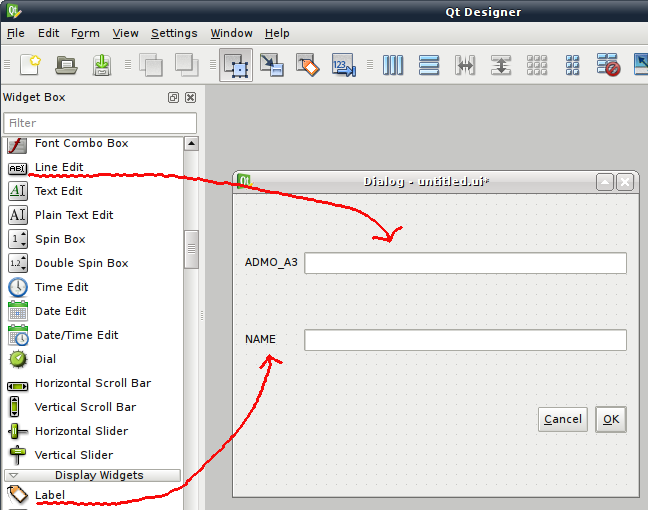

================================
*Form* personalizzate
================================

Una possibilità interessante di personalizzazione di QGIS è l'utilizzo di *form* personalizzate per la gestione dei dati. QGIS integra un meccanismo che rende la creazione di tale tipo di *form* relativamente semplice.

Potremmo fare qualcosa di più interessante con queste *form* aggiungendo, ad esempio, delle funzionalità di validazione dei dati.

Creazione della *form*
----------------------

Aprite Qt Designer e cliccate su "Dialog with Buttons Bottom" per creare la finestra di dialogo.
Prendiamo come esempio il file *50m_admin_0_countries*, che ha i seguenti campi attributo:

- ADM0_A3
- NAME
- SOVISO
- TYPE
- PEOPLE
- GDP_USDM
- COMMENT

Andremo a creare una *form* per la visualizzazione e modifica dei campi **ADM0_A3** (identificatore univoco) e **NAME**. 
Aggiungiamo, per ogni campo, un'etichetta (Label da Display Widgets) ed una casella di modifica testo (Line edit da Input Widgets).
Configuriamo, ora, la *form* con una disposizione a griglia (click tasto destro in una zona vuota -> Layout -> Layout in Grid).

Un suggerimento: date agli oggetti della *form* lo stesso nome dei campi del layer di dati; click tasto destro sui widget delle caselle di testo 
e modificate l'**objectName**, assegnando il nome del campo corrispondente. Salvate la *form* (*.ui*).

In QGIS, caricate il layer  *50m_admin_0_countries* ed aprite la finestra delle proprietà. Nella scheda "Generale" inserite in "Modulo di inserimento" il file della *form* appena creata. 
Attivate una sessione di modifica e con il pulsante "Informazioni elementi" selezionate un oggetto nell'area mappa. Nella finestra di dialogo "Informazioni sui risultati", sotto la voce "Azioni", fate doppio click su "Form di modifica geometria" per aprire la *form* personalizzata. Essendo in modalità di modifica, ogni cambiamento effettuato tramite la nostra *from* sarà salvata nel file di dati; se non si è in modalità modifica, i widget della *form* non saranno attivi.

Validazione
-----------

Crazione del modulo
^^^^^^^^^^^^^^^^^^^

Creare una *form* personalizzata è una prima tappa interessante, ma ancora più interessante è aggiungere del codice per fare validazione dati.
Aggiungiamo una funzionalità di validazione del campo NAME, in modo da evitare che l'utente possa inserire dei paesi senza nome (valore NULL).

Salviamo il progetto QGIS. Il modulo Python che andiamo a sviluppare lo salviamo nella cartella del progetto.
Apriamo un editor di testo e scriviamo il seguente codice::

    from PyQt4.QtCore import *
    from PyQt4.QtGui import *

    nameField = None
    myDialog = None

    def formOpen(dialog,layerid,featureid):
        global myDialog
        myDialog = dialog
        global nameField
        nameField = dialog.findChild(QLineEdit,"NAME")
        buttonBox = dialog.findChild(QDialogButtonBox,"buttonBox")

        # Disconnessione del segnale che QGIS ha automaticamente associato alla zona dei pulsanti
        buttonBox.accepted.disconnect(myDialog.accept)

        # Connessione del nostro segnale
        buttonBox.accepted.connect(validate)
        buttonBox.rejected.connect(myDialog.reject)

    def validate():
      # Il campo NAME non può essere vuoto
        if not nameField.text().length() > 0:
            msgBox = QMessageBox()
            msgBox.setText("Le champ NAME ne peut pas etre vide.")
            msgBox.exec_()
        else:
            # Restituiamo a QGIS la finestra di dialogo come accettata
            myDialog.accept()

Analizziamo il codice in dettaglio.

Dettagli del modulo
^^^^^^^^^^^^^^^^^^^

Come prima cosa importiamo i moduli di Qt ed impostiamo le variabili globali per la gestione del nome del campo e della finestra di dialogo::

    from PyQt4.QtCore import *
    from PyQt4.QtGui import *

    nameField = None
    myDialog = None

Creiamo, in seguito, un metodo che sarà chiamato da QGIS quando caricherà la *form*. Il metodo prende come argomento un'istanza della *form*, l'*id* del layer e l'*id* di un elemento::

    def formOpen(dialog,layerid,featureid):

Utilizzando il metodo *findChild*, recuperiamo il riferimento al campo NAME ed ai pulsanti (buttonBox). Chiamiamo **buttonBox.accepted.disconnect()**
per disconnettere gli *slot* che QGIS ha automaticamente connesso ai nostri pulsanti, in modo da poter utilizzare la nostra logica di validazione.

Connettiamo la nostra logica di validazione utilizzando **buttonBox.accepted.connect(validate)**\ ::

    global myDialog
    myDialog = dialog
    global nameField
    nameField = dialog.findChild(QLineEdit,"Name")
    buttonBox = dialog.findChild(QDialogButtonBox,"buttonBox")
    # Disconnessione del segnale che QGIS ha automaticamente associato alla zona dei pulsanti
    buttonBox.accepted.disconnect(myDialog.accept)

    # Connessione del nostro segnale
    buttonBox.accepted.connect(validate)
    buttonBox.rejected.connect(myDialog.reject)

Abbiamo bisogno di un metodo per validare la logica della *form*. Il metodo sarà chiamato all'emissione del segnale **buttonBox.accepted()**. La logica di questo metodo di validazione è molto semplice: se la casella di modifica testo ha una dimensione positiva (se c'è del testo), allora è validato, altrimenti viene visualizzato un messaggio di errore::

    def validate():
      # Il campo NAME non può essere vuoto
        if not nameField.text().length() > 0:
            msgBox = QMessageBox()
            msgBox.setText("Name field can not be null.")
            msgBox.exec_()
        else:
            # Restituiamo a QGIS la finestra di dialogo come accettata
            myDialog.accept()

Configurazione di QGIS
^^^^^^^^^^^^^^^^^^^^^^

Ora bisogna configurare QGIS affinchè utilizzi la nostra funzione di validazione. Salvate il file nella stessa cartella del progetto QGIS.
QGIS ricercherà il nostro modulo nella cartella del progetto o in quella di Python, vale a dire nei percorsi predefiniti ed in quelli 
definiti da PYTHONPATH.

Nella scheda "Generale" delle proprietà del layer, possiamo impostare il campo "Funzione di avvio": la sintassi è *{nome del modulo}.{nome della funzione}*.
Nel nostro caso il modulo (il file Python appena creato) si chiama **CountryForm** e la funzione **formOpen**, quindi inseriamo nel campo "Funzione di avvio" la stringa **CountryForm.formOpen**.

Utilizzate lo strumento "Informazioni elementi" e selezionate un oggetto dell'area mappa. Se è tutto andato per il verso giusto, non dovreste ricevere errori. Provate a cancellare il testo del campo NAME e cliccare su OK: apparirà un messaggio di errore.

La modifica del campo è validata solo se NAME è non-nullo.

Qualcosa in più
---------------

Invece di far visualizzare un messaggio di errore, possiamo fare in modo che la casella di testo diventi rossa se qualcosa non è valido::

    from PyQt4.QtCore import *
    from PyQt4.QtGui import *

    nameField = None
    myDialog = None

    def formOpen(dialog,layerid,featureid):
      global myDialog
      myDialog = dialog
      global nameField
      nameField = dialog.findChild(QLineEdit,"NAME")
      buttonBox = dialog.findChild(QDialogButtonBox,"buttonBox")

      nameField.textChanged.connect(Name_onTextChanged)
      # Disconnessione del segnale che QGIS ha automaticamente associato alla zona dei pulsanti
      buttonBox.accepted.disconnect(myDialog.accept)
      # Connessione del nostro segnale
      buttonBox.accepted.connect(validate)
      buttonBox.rejected.connect(myDialog.reject)

    def validate():
      # Il campo NAME non può essere vuoto
      if not nameField.text().length() > 0:
        nameField.setStyleSheet("background-color: rgba(255, 107, 107, 150);")
        msgBox = QMessageBox()
        msgBox.setText("Name field can not be null.")
        msgBox.exec_()
      else:
      # Restituiamo a QGIS la finestra di dialogo come accettata
        myDialog.accept()

    def Name_onTextChanged(text):
      if not nameField.text().length() > 0:
        nameField.setStyleSheet("background-color: rgba(255, 107, 107, 150);")
      else:
        nameField.setStyleSheet("")

Gli elementi importanti, qui, sono **nameField.textChanged.connect(Name_onTextChanged)** ed il metodo **Name_onTextChanged(text)**.
Provate, dovrebbe funzionare.

Esercizi
--------

* Provate a fare la stessa cosa con altri campi
* Disattivate la possibilità di modificare l'*id* di un elemento
* Prendete un camp "date" e validate se la data è posteriore a 1900
* Verificate che i campi SOVISO e SOV_A3 abbiano il numero giusto di lettere
* Fate in modo che l'utente non possa scegliere che entro i 5 valori possibili del campo 'TYPE'
* Fate la stessa cosa con uno dei vostri layer di dati
* Create un nuovo layer di punti che si riferiscono a delle foto sul vostro computer. Visualizzare il nome delle foto nella *form*

